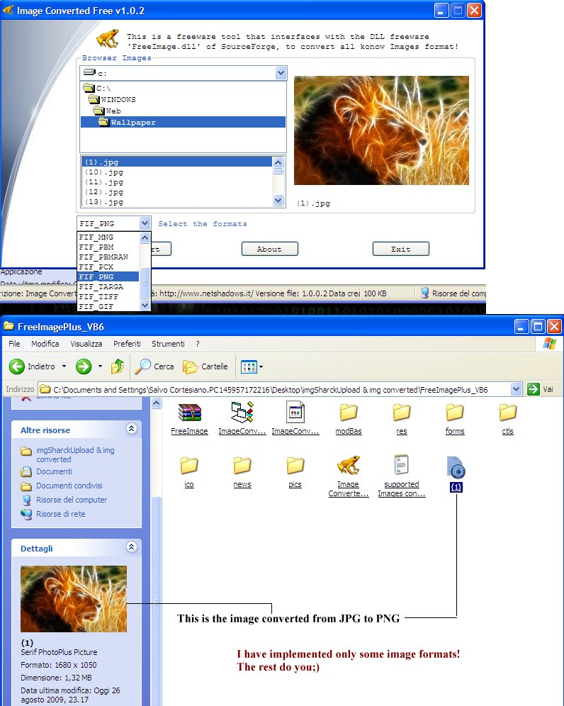



## How to convert many image formats using the freeware library 'FreeImage\.dll'

### Description

How to convert many image formats using the freeware library FreeImage.dll?

Supported formats: BMP files [reading, writing]/DDS files [reading]/EXR files [reading, writing]/Raw Fax G3 files [reading]/GIF files [reading, writing]/HDR files [reading, writing]/ICO files [reading, writing]/IFF files [reading]/JBIG [reading, writing] **/JNG files [reading]

/JPEG/JIF files [reading, writing]/JPEG-2000 File Format [reading, writing]/JPEG-2000 codestream [reading, writing]/KOALA files [reading]/Kodak PhotoCD files [reading]/MNG files [reading]/PCX files [reading]/PFM files [reading, writing]/PBM files [reading, writing]/PGM files [reading, writing]/PNG files [reading, writing]/PPM files [reading, writing]/PhotoShop files [reading]/Sun RAS files [reading]/SGI files [reading]/TARGA files [reading, writing]/TIFF files [reading, writing]/WBMP files [reading, writing]/XBM files [reading]/XPM files [reading, writing]
 
### More Info
 

             |
---                |---
**Submitted On**   |2009-08-19 15:06:30
**By**             |[Salvo Cortesiano \(Italy\)](https://github.com/Planet-Source-Code/PSCIndex/blob/master/ByAuthor/salvo-cortesiano-italy.md)
**Level**          |Advanced
**User Rating**    |5.0 (30 globes from 6 users)
**Compatibility**  |VB 6\.0
**Category**       |[Graphics](https://github.com/Planet-Source-Code/PSCIndex/blob/master/ByCategory/graphics__1-46.md)
**World**          |[Visual Basic](https://github.com/Planet-Source-Code/PSCIndex/blob/master/ByWorld/visual-basic.md)
**Archive File**   |[How\_to\_con2161038262009\.zip](https://github.com/Planet-Source-Code/salvo-cortesiano-italy-how-to-convert-many-image-formats-using-the-freeware-library-freeim__1-72401/archive/master.zip)

